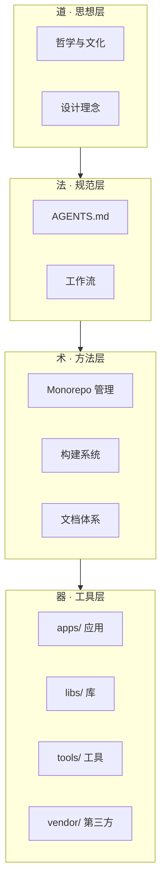

# Xuanspace（玄境）

> 技术为器、思想为道，器以载道


## 关于玄境

"玄境"取自《老子》**"玄之又玄，众妙之门"**。

这是一个技术与文化项目共存的空间。我们相信：

- **技术为器**：工具与实现是基础
- **思想为道**：哲学与文化是灵魂
- **器以载道**：技术服务于更高的思想追求

玄境同时容纳多种类型的项目：Python 库、C++ 原生扩展、CLI 工具、静态 HTML 文化项目（如竹简悟道）等。在这里，代码不仅是解决问题的工具，更是承载思想的载体。

## 特性亮点

- 📦 **Monorepo 架构**：统一管理多个子项目，workspace 自动链接
- 🐍 **Python 3.13+**：严格遵循最新 Python 标准
- 🔧 **多包管理器支持**：PDM（推荐）、uv（快速）、pip（标准）均可使用，不强制绑定
- ⚡ **C++ 原生扩展**：集成 CMake + Ninja + scikit-build-core 构建链，跨平台一致
- 📚 **Sphinx 文档**：MyST Markdown 语法，支持 Mermaid 图表，美观的文档主题
- 🤖 **AI Agent 就绪**：内置 AGENTS.md 和 `.agents/` 规范目录，支持 AI 协作开发
- 🔄 **版本管理**：`xs` CLI 提供统一版本 bump 和 CHANGELOG 生成
- 🏗️ **跨平台构建**：Windows/macOS/Linux 一致性保证

## 5 分钟快速开始

### 前置条件

- Python 3.13+（硬性要求，不兼容版本会给出明确错误）
- Git
- **可选**：PDM（推荐包管理器）
- **可选**：CMake + Ninja（仅构建 C++ 原生扩展需要）

### 安装步骤

1. 克隆仓库（包含子模块）：

   ```bash
   git clone --recurse-submodules https://github.com/xinetzone/xuanspace.git
   ```

2. 进入项目目录：

   ```bash
   cd xuanspace
   ```

3. 选择一种方式安装依赖：

   **使用 PDM（推荐）：**
   ```bash
   pdm install
   pdm run xs --help
   ```

   **使用 pip（标准）：**
   ```bash
   pip install -e ".[dev]"
   xs --help
   ```

   **使用 uv（快速）：**
   ```bash
   uv pip install -e ".[dev]"
   xs --help
   ```

4. 查看所有子项目：

   ```bash
   xs list
   ```

5. 检查开发环境：

   ```bash
   xs doctor
   ```

## 项目索引

| 名称 | 描述 | 语言 | 类型 | 状态 | 版本 | 文档 |
|------|------|------|------|------|------|------|
| xs-cli | Xuanspace CLI 工具（15 个子命令） | Python 3.13 | tools | 🟢 开发中 | 0.1.0 | [CLI 参考](docs/cli/index.md) |
| xuan-core | 核心工具库 | Python 3.13 | lib | 🟢 开发中 | 0.1.0 | [API 参考](docs/) |
| xuan-ext-demo | C++ 原生扩展示例（pybind11） | Python/C++ | lib(native) | 🟡 示例 | 0.1.0 | [构建指南](docs/build-system.md) |
| templates | 项目模板（Python/Native/Static） | Python/C++/HTML | tools | 🟢 可用 | 0.1.0 | [模板说明](tools/templates/) |

## 架构设计

玄境遵循**道-法-术-器**四层架构：



## 目录结构

```
xuanspace/
├── apps/          # 可执行应用程序（CLI 工具、服务等）
├── libs/          # 共享库（Python 库、C++ 扩展）
├── vendor/        # 第三方依赖（作为 Git 子模块管理）
├── tools/         # 独立工具集（构建脚本、代码生成器等）
├── docs/          # Sphinx 文档源文件
├── scripts/       # 项目运维脚本
├── attic/         # 归档内容（不活跃但有参考价值的项目）
├── .agents/       # AI Agent 配置与脚本
├── .meta/         # 项目元数据
├── AGENTS.md      # AI 智能体协作指南
├── pyproject.toml # 根项目配置
└── CMakeLists.txt # CMake 构建配置
```

## 文档与资源

- 📖 **完整文档**：Sphinx 构建后位于 `docs/_build/html/`
- 🤝 **贡献指南**：详见 [CONTRIBUTING.md](CONTRIBUTING.md)
- 🤖 **AI 协作**：详见 [AGENTS.md](AGENTS.md)
- 🐛 **问题反馈**：[GitHub Issues](https://github.com/xinetzone/xuanspace/issues)
- 📝 **更新日志**：详见 [CHANGELOG.md](CHANGELOG.md)

更多技术细节和开发指南请查阅 `docs/` 目录。

## 许可证

MIT License - 详见 [LICENSE](LICENSE) 文件。
