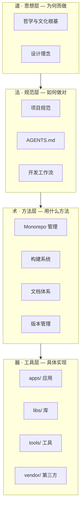

# 架构设计

## 道-法-术-器 四层架构

玄境遵循中国传统哲学中的**道-法-术-器**四层递进架构：



### 道：思想层

决定项目的存在意义和设计哲学。"技术为器、思想为道，器以载道"——技术服务于更高的思想追求。

### 法：规范层

约定如何正确地做事。包括 `AGENTS.md` 智能体协作规范、开发工作流、代码规范、提交规范等。

### 术：方法层

选择具体的技术方案。Monorepo 组织方式、构建系统选型、文档体系设计、版本管理策略。

### 器：工具层

可执行的具体实现。`apps/`、`libs/`、`tools/`、`vendor/` 中的每一行代码。

## Monorepo 结构

### 目录约定

```
xuanspace/
├── apps/              # 可执行应用和 CLI 工具
│   ├── culture/       #   文化类应用（子目录分组）
│   └── ...
├── libs/              # 可复用 Python 库和 C++ 原生扩展
│   ├── xuan-core/     #   核心 Python 库
│   ├── xuan-ext-demo/ #   C++ 原生扩展示例
│   └── ...
├── vendor/            # 第三方依赖（Git 子模块，只读）
├── tools/             # 项目内部工具链
│   ├── xs/            #   xs CLI 工具
│   ├── templates/     #   项目模板
│   └── ...
├── docs/              # Sphinx 文档源文件
├── scripts/           # 构建和维护脚本
├── attic/             # 归档项目（不活跃但有参考价值）
├── .agents/           # AI 智能体规范目录
├── .meta/toml/        # 文档元数据（TOML 格式）
├── AGENTS.md          # AI 智能体协作入口
├── pyproject.toml     # 根项目配置（PEP 621）
├── CMakeLists.txt     # CMake 顶层配置
├── CMakePresets.json  # 跨平台构建预设
└── README.md          # 项目说明
```

### 子项目分类

| 目录 | 适用场景 | 示例 |
|---|---|---|
| `apps/` | 可执行应用、CLI 工具、面向最终用户的程序 | 竹简悟道（HTML/JS 文化应用） |
| `libs/` | 可复用的 Python 库、C++ 原生扩展 | xuan-core（核心库）、xuan-ext-demo（原生扩展） |
| `vendor/` | 第三方依赖、fork 的外部项目（只读） | 需要 patch 的第三方库 |
| `tools/` | 项目内部工具链、模板、构建辅助 | xs CLI |

## 依赖管理

### 集中式依赖声明

所有依赖在根 `pyproject.toml` 中按功能分组声明：

```toml
[project.optional-dependencies]
docs = ["sphinx>=8.0", "myst-parser>=4.0"]
test = ["pytest>=8.0", "pytest-cov>=5.0"]
lint = ["mypy>=1.10", "ruff>=0.4"]
build = ["build>=1.2", "scikit-build-core>=0.10", "cmake>=3.26", "ninja"]
dev = ["pdm", "typer>=0.12", "xuanspace[docs,test,lint,build]"]
```

### 包管理器选择

| 包管理器 | 特点 | 适用场景 |
|---|---|---|
| PDM | Workspace 自动链接，符合 PEP 621 | 推荐，日常开发 |
| uv | 安装速度极快，Rust 实现 | 快速环境搭建 |
| pip | Python 自带，无额外安装 | 标准方式，CI 环境 |

## 版本管理

### 子项目版本

每个子项目独立维护版本号，存储在各自 `pyproject.toml` 的 `version` 字段。

### 版本 bump

```bash
xs version bump <project> --type major|minor|patch
```

### Git 标签

格式：`<project>@<version>`

```
xuan-core@0.2.0
xuan-ext-demo@0.1.1
```

## 子模块策略

### 第三方库（vendor/）

- 仅在需要 patch 第三方库时使用
- 作为 Git 子模块管理
- 保持与上游同步

### 自建库（projects/）

- 在 SpecWeave 主仓库中作为 Git 子模块
- 独立开发，独立版本控制
- 通过子模块指针在主仓库中统一管理

## 设计决策

### 为什么选择 Monorepo？

- **统一规范**：代码风格、CI/CD、文档标准一致
- **依赖可见**：所有依赖关系在同一仓库中，变更影响一目了然
- **原子变更**：跨子项目的修改可以在一次 PR 中完成
- **简化协作**：新成员只需 clone 一个仓库

### 为什么不强制 PDM？

- 降低新成员的入门门槛
- CI 环境可能预装 pip 而非 PDM
- 遵循 PEP 517/621 标准，确保互操作性

### 为什么选择 CMake + Ninja？

- CMake 是 C++ 生态的事实标准
- Ninja 提供极快的增量编译
- scikit-build-core 无缝集成 Python 打包