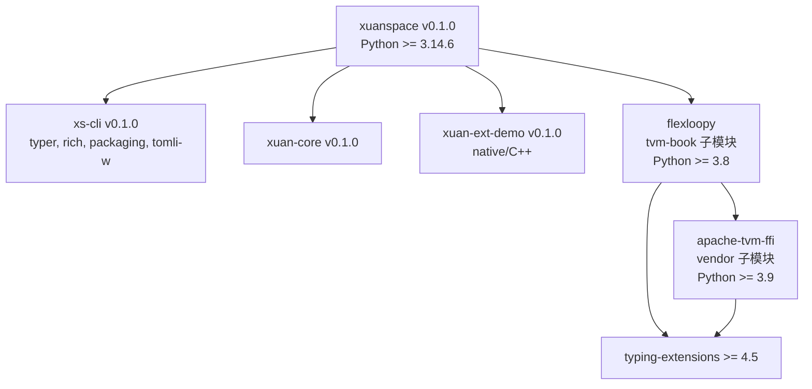

# Xuanspace（玄境）项目依赖树报告

> 生成日期：2026-07-24 | 根版本：v0.1.0 | Python >= 3.14.6

## 1. 目录结构

```
xuanspace/                          # 根项目（Monorepo）
├── libs/                           # 自建/第三方库
│   ├── xuan-core/                  # 核心工具库 v0.1.0
│   ├── xuan-ext-demo/              # C++ 原生扩展示例 v0.1.0
│   └── tvm-book/                   # [submodule] TVM 中文手册 (flexloopy)
├── apps/                           # 应用（空，待填充）
├── tools/                          # 开发工具
│   ├── xs/                         # xs-cli v0.1.0（CLI 命令行工具）
│   └── templates/                  # 项目模板（python/native/static）
├── vendor/                         # 上游第三方依赖
│   └── tvm-ffi/                    # [submodule] Apache TVM-FFI
│       └── 3rdparty/
│           ├── dlpack/             # [nested submodule] DLPack v1.3
│           └── libbacktrace/       # [nested submodule] libbacktrace
├── docs/                           # Sphinx + MyST 文档
├── tests/                          # 项目级测试
├── scripts/                        # 构建/运维脚本
├── attic/                          # 归档项目
└── .github/workflows/              # CI/CD（quality + template-validation）
```

## 2. Git 子模块依赖树

```
xuanspace (main repo)
│
├── libs/tvm-book @ 83c4baa (v0.1.4-3)
│   └── (无嵌套子模块)
│
└── vendor/tvm-ffi @ 135c2e8 (v0.1.12-57)
    ├── 3rdparty/dlpack @ 84d107b (v1.3)
    └── 3rdparty/libbacktrace @ 7939218
```

## 3. Python 包依赖图



## 4. 依赖关系矩阵

| 包名 | 来源 | 版本 | Python | 运行时依赖 | 类型 |
|------|------|------|--------|-----------|------|
| `xuanspace` | 根 | 0.1.0 | >=3.14.6 | — | monorepo-root |
| `xs-cli` | self | 0.1.0 | >=3.14.6 | typer, rich, packaging, tomli-w | tools |
| `xuan-core` | self | 0.1.0 | >=3.14.6 | 无 | lib |
| `xuan-ext-demo` | self | 0.1.0 | >=3.14.6 | 无 | lib(native) |
| `flexloopy` | submodule | — | >=3.8 | typing-extensions, apache-tvm-ffi | lib |
| `apache-tvm-ffi` | submodule | — | >=3.9 | typing-extensions | vendor |
| `dlpack` | nested | v1.3 | — | — | vendor(C) |
| `libbacktrace` | nested | — | — | — | vendor(C) |

## 5. 关键依赖链

```
flexloopy → apache-tvm-ffi → typing-extensions
```

### Python 版本兼容性

| 包 | 要求 | 根项目 (>=3.14.6) | 状态 |
|----|------|:---:|:---:|
| xs-cli | >=3.14.6 | 一致 | ✅ |
| xuan-core | >=3.14.6 | 一致 | ✅ |
| xuan-ext-demo | >=3.14.6 | 一致 | ✅ |
| flexloopy | >=3.8 | 向下兼容 | ✅ |
| apache-tvm-ffi | >=3.9 | 向下兼容 | ✅ |

## 6. 开发依赖（按分组）

| 分组 | 依赖 | 用途 |
|------|------|------|
| **docs** | sphinx, myst-parser, sphinx-book-theme, sphinx-design, sphinx-copybutton, sphinxcontrib-mermaid | 文档构建 |
| **test** | pytest, pytest-cov, pytest-xdist | 测试框架 |
| **lint** | mypy, ruff, black, isort | 代码质量 |
| **build** | build, scikit-build-core, cmake, ninja | 构建系统 |
| **dev** | pdm, typer, rich, packaging, tomli-w, xs-cli + 上述全部 | 全量开发环境 |

## 7. CI 流水线

| Job | 触发条件 | 覆盖 |
|-----|---------|------|
| `quality` | push/PR | `xs doctor` + `xs meta validate` + `xs lfs check` + `xs docs build` |
| `template-validation` | push/PR | 3 平台 x 3 模板类型（python/native/static） |
| `test` | push/PR | Python 3.14 单元测试 |
| `lint` | push/PR | ruff + mypy + black |

<!-- changelog -->
- 2026-07-24 | docs | 初始版本，涵盖目录结构、Git 子模块树、Python 包依赖图、依赖矩阵、版本兼容性、开发依赖、CI 流水线