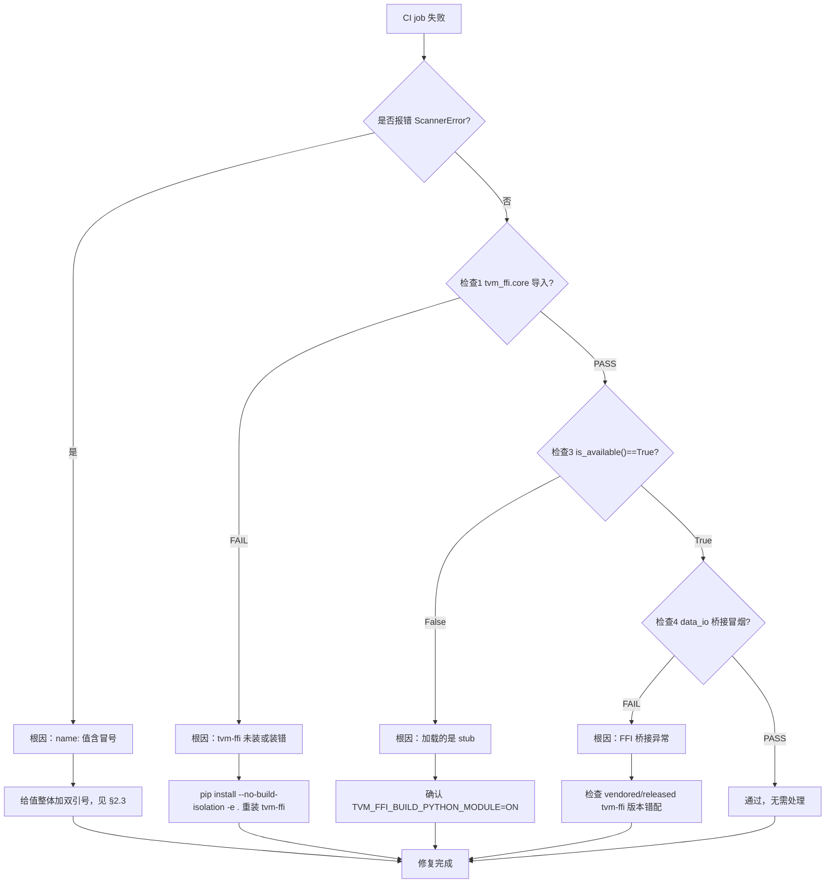

# caffe-ffi CI 运维指南

> 用途：沉淀 CI 流水线运维要点，聚焦两类近期踩坑——**YAML 解析错误**与 **TVM-FFI 依赖加载检查**。
> 适用版本：2026-08-05

## 1. 流水线概览

`.github/workflows/ci.yml` 包含 4 个 job：

| Job | 触发 | 重点 |
|-----|------|------|
| `build-and-test` | push / PR / 手动 | 三平台矩阵构建 + 全量测试 + wheel |
| `cpp-tests` | push / PR / 手动 | 仅 Linux，C++ 单测（`ctest`） |
| `lint` | push / PR / 手动 | ruff 静态检查 + C¹ 拐点保护检查 |
| `nightly` | schedule（每日 02:00 UTC）/ 手动 | 扩展回归 + P2 Data-IO + TVM-FFI 依赖检查 |

## 2. YAML 解析错误（门槛问题）

### 2.1 现象

GitHub Actions 触发时直接报错：

```
yaml.scanner.ScannerError: mapping values are not allowed here
```

### 2.2 根因

GitHub Actions 的 `name:` 字段值若**包含冒号 `:`**（如 `CLI smoke: --help returns 0`），
YAML 会将 `冒号+空格` 识别为 mapping 分隔符，导致解析失败。

### 2.3 修复方法

给值**整体加双引号**包裹：

```yaml
# ❌ 错误：值含冒号未加引号
- name: CLI smoke: --help returns 0

# ✅ 正确：用双引号包裹整个值
- name: "CLI smoke: --help returns 0"
```

本仓库共修复 6 处（均在 `nightly` job 的 CLI 冒烟/回归步骤）。

### 2.4 预防检查

- 任何 `name:` 值含 `:`、`#`、`|`、`&` 等特殊字符时，一律加双引号。
- 本地校验：`python -c "import yaml,sys; yaml.safe_load(open('.github/workflows/ci.yml', encoding='utf-8'))"`，
  或先用 `actionlint` 做静态校验。

## 3. TVM-FFI 依赖加载检查

### 3.1 为什么需要

TVM-FFI 是 caffe-ffi 的运行时依赖。历史 P0 阻塞的根因都属于**依赖加载**而非业务逻辑：

- `ModuleNotFoundError: tvm_ffi.core`（Cython 扩展缺失）
- `caffe_ffi` 回退到 Python-only stub（`is_available()==False`），测试静默 FAIL
- 版本错配 / 符号缺失（Windows 下表现为 `WinError 127`）

### 3.2 检查脚本

`scripts/ci_check_tvmffi.py`（跨平台、轻量、零外部依赖）：

| 步骤 | 检查内容 |
|------|---------|
| 1 | `tvm_ffi` 可导入，且 `tvm_ffi.core` 扩展二进制物理存在（`.so`/`.pyd`/`.dll`） |
| 2 | core 扩展链接到 `libtvm_ffi`（Linux 用 `ldd`、Windows 用 `dumpbin`，缺失则跳过） |
| 3 | `caffe_ffi.is_available()==True`，确认加载的是 C++ 扩展而非 stub |
| 4 | data-IO 回调 FFI 桥接冒烟：注册回调 → Data 层 forward → 断言回调填充可见 |

退出码：`0` 全部通过，`1` 任一失败。

### 3.3 接入位置

在 `pip install --no-build-isolation -e .` 之后、跑测试之前执行：

```yaml
- name: TVM-FFI dependency loading check
  env:
    KMP_DUPLICATE_LIB_OK: TRUE
  run: |
    python scripts/ci_check_tvmffi.py
```

- **`build-and-test`**：所有平台矩阵都执行（一次普通构建即可暴露）。
- **`nightly`**：每日执行，覆盖 schedule 与手动触发。

> 注意：`KMP_DUPLICATE_LIB_OK=TRUE` 必须设置——Windows 下 OpenMP 多副本共存是常态，
> 缺失会导致 `libiomp5` 冲突直接崩溃。

## 4. 常见故障排查

| 现象 | 定位 | 处理 |
|------|------|------|
| job 直接报 `ScannerError` | 某 `name:` 含冒号 | 给值加双引号（见 §2.3） |
| 检查 1 FAIL | tvm-ffi 未装或装错 | `pip install --no-build-isolation -e .` 重装 tvm-ffi |
| 检查 3 `is_available()==False` | 加载的是 stub | 确认 `TVM_FFI_BUILD_PYTHON_MODULE=ON` 已启用 |
| 检查 4 FAIL | FFI 桥接异常 | 检查 vendored/released tvm-ffi 版本错配 |

故障排查决策流程如下：



> 检查 1/2/3/4 编号对应 §3.2 `ci_check_tvmffi.py` 的 4 个检查步骤。

## 5. 变更清单

- `.github/workflows/ci.yml`：修复 6 处 YAML 引号问题；`nightly` 新增
  TVM-FFI 依赖检查 + P2 Data-IO 测试步骤。
- `scripts/ci_check_tvmffi.py`：新增跨平台依赖加载检查脚本。