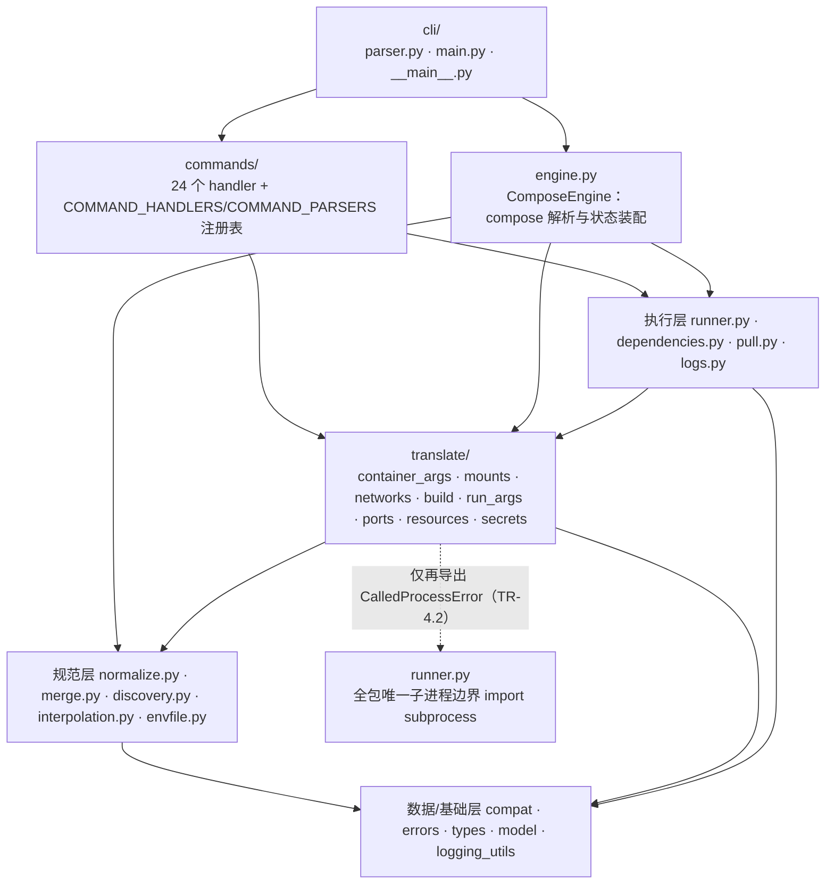

# xuan-compose

> Compose 规范声明式容器编排引擎，Xuanspace（玄境）monorepo 纯 Python 库。
> 由 [containers/podman-compose](https://github.com/containers/podman-compose) v1.6.0
> 逐行翻译式分层重构，CLI 与解析行为与上游 1.6.0 对等（argparse 参数表快照零差异）。

## 来源与许可

- 上游：[containers/podman-compose](https://github.com/containers/podman-compose)
- 上游 pinned commit：`e3df10472e194ab6d547b5ad25542c5c79e1a5fb`
- 重构方式：将上游 5541 行单体 `podman_compose.py` 翻译式搬迁为分层包（translate-then-move），
  行为与 1.6.0 对等；结构差异与 py3.14 现代化逐条登记见
  [docs/parity.md](docs/parity.md)（142 个公开符号 100% 映射）
- 许可证：**GPL-2.0-only**（继承上游，不得重新许可）；完整许可证文本见 [LICENSE](LICENSE)；
  src/tests/scripts 全部 96 个 `.py` 文件均携带 `SPDX-License-Identifier: GPL-2.0-only` 头

## 安装

```bash
# 于本目录（libs/xuan-compose）
pip install -e .
# 或带测试/lint 可选依赖
pip install -e ".[test,lint]"
```

要求 Python ≥ 3.14。

安装后同时提供：

- 库包 `xuan_compose`（库优先：**仅 import 不产生任何副作用**，不读 argv、不启动子进程）；
- console script `xuan-compose`（`[project.scripts]`，与上游 `podman-compose` 等价）。

> 构建说明：scikit-build-core 的 CMake 产物全部落在 `build/{wheel_tag}/`（已被
> xuanspace 根 `.gitignore` 忽略），源码根目录保持干净。本库**不使用**
> `editable.mode = "inplace"`（该模式会强制在源码目录内 configure CMake）；
> 测试经 `pytest` 的 `pythonpath=["src"]` 始终直连 src，无需重装。

## 快速开始

### 库 API（显式装配，无全局单例）

```python
from xuan_compose.engine import ComposeEngine
from xuan_compose.cli.parser import parse_args

engine = ComposeEngine()                 # 纯状态对象：零子进程、零 argv 读取
# parse_args 纯解析（无文件也能跑）；args 即 argparse.Namespace，
# engine.global_args 同步回写
args = parse_args(engine, ["-f", "compose.yaml", "config", "--quiet"])
print(args.command, args.file)           # -> config ['compose.yaml']

# 以下需要当前目录存在 compose.yaml：加载/合并/规范化 compose 文件
engine._parse_compose_file()
print(engine.project_name, sorted(engine.all_services))
```

如需完整运行时（装配 podman runner、版本探测、命令分发），使用 CLI 装配链：

```python
from xuan_compose.cli.main import async_main
import asyncio

asyncio.run(async_main(["--dry-run", "-f", "compose.yaml", "up"]))
```

纯翻译函数也可单独使用（不依赖引擎实例）：

```python
from xuan_compose.translate.container_args import container_to_args
from xuan_compose.translate.mounts import parse_short_mount

m = parse_short_mount("./data:/var/lib/mysql", basedir=".")
```

### 命令行

```bash
# console script
xuan-compose --help
xuan-compose -f compose.yaml ps

# 或模块入口（两者等价；24 个命令 + help 伪命令）
python -m xuan_compose --help
python -m xuan_compose -f compose.yaml up -d
```

## 架构分层



依赖严格单向、无环（经 T11 独立审查逐条核对 108 条内部 import）：

- 主链路 `cli → commands → engine → {执行层, 翻译层, 规范层} → 数据/基础层`；
- `commands` 不 import `engine`（handler 以 `compose: Any` 鸭子类型收引擎，
  静态不耦合）；`engine → translate`、执行层的 `pull/logs → translate.run_args`
  为同向下行边；
- 翻译层不反向依赖 engine/commands/cli；规范层内部 `normalize → merge` 单向
  （`resolve_extends` 已下沉 normalize，消除早期的惰性导入环）；
- `runner.py` 是全包唯一 `import subprocess` 的边界模块，其他层只消费它
  再导出的 `CalledProcessError`；
- `sys.argv` 的真实读取只存在于 `cli/main.py` 单点。

## 对等性与差异

- argparse 参数表（option strings/action/default/nargs/required/const/choices/metavar/type/help，
  prog 除外）对上游 e3df104 快照**零差异**：见 `tests/snapshots/cli_parity.json`
  与 `tests/test_cli_parity.py`；快照由 `tests/generate_parity_snapshots.py` 生成。
- 142 个上游公开符号的逐模块映射、重命名（`PodmanCompose→ComposeEngine`）、
  删除项（`cmd_run`/`cmd_parse` 装饰器副作用）与 13 类 py3.14 差异：
  [docs/parity.md](docs/parity.md)。

## 测试

```bash
# WSL（权威门禁环境，POSIX 路径语义，与上游 CI 一致）
cd /mnt/d/spaces/SpecWeave/projects/xuanspace/libs/xuan-compose
PYTHONPATH=src ~/.venvs/xuan-gate/bin/pytest -q \
  --cov=src/xuan_compose --cov-report=term-missing

# Windows py314：lint 与类型检查权威环境
ruff check src tests
mypy src
```

- WSL py3.14：940 passed / 0 skip；覆盖率整体 91%，核心模块
  interpolation/normalize/merge/engine/translate 全部 ≥90%。
- Windows 原生 py3.14：除路径分隔符敏感用例外全绿（`\`/`/`、盘符根、
  `os.path.join` 尾段差异——与上游在 Windows 上行为同构，非逻辑差异）。
- 上游 `tests/unit/` 26 个测试文件全部同名移植（484 例 ≥ 上游 478，skip=0），
  另含分层架构自建行为测试；全部单测零真实 podman（子进程边界 fake）。

### 需要真实 podman 的手工集成验证

需要真实 podman 守护的上游集成测试不在本库门禁内；可在装有 podman 的 WSL 中手工验证：

```bash
cat > compose.yaml <<'YAML'
services:
  web:
    image: docker.io/library/nginx:stable
    ports: ["8080:80"]
YAML

python -m xuan_compose up -d
python -m xuan_compose ps
python -m xuan_compose logs -f
python -m xuan_compose down
```

## 变更历史

见 [CHANGELOG.md](CHANGELOG.md)。
