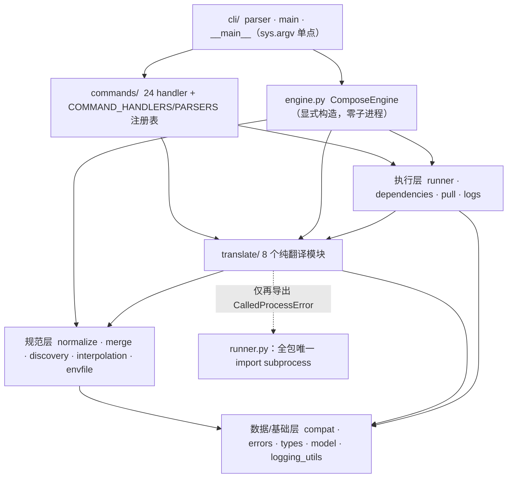

# xuan-compose 分层重构交付总结报告（T1-T12）

> 交付日期：2026-09-16
> 上游基线：containers/podman-compose v1.6.0，pinned commit
> `e3df10472e194ab6d547b5ad25542c5c79e1a5fb`（GPL-2.0-only）
> 交付方式：translate-then-mount（翻译式搬迁，非兼容封装、非重写）
> 远端状态：12 笔子模块提交 + 配套主仓提交**已推送**（xuanspace GitHub / SpecWeave GitCode）
> 关联文档：[parity.md](parity.md)（符号映射与差异）、[review.md](review.md)（独立对抗审查）、
> [../README.md](../README.md)（使用手册）、spec
> `.trae/specs/xuan-compose-refactor/`（T1-T12 全程任务记录）

---

## 1. 执行摘要

将上游 **5541 行单文件** `podman_compose.py` 逐行翻译为 **7 层、39 个源模块（6472 行）**
的 Python 3.14 纯库包 `xuan_compose`，CLI/解析/编排行为与上游 1.6.0 **对等**：

- **argparse 参数表对上游快照零差异**（25 个 subparser，11 个维度逐 action 对拍，prog 除外）；
- **142 个上游公开符号 100% 映射**（139 同名、1 重命名、2 删除，另移除 2 项结构性副作用）；
- **940 个测试 / 0 skip**，其中上游 26 个单元测试文件 484 例 ≥ 上游 478 例，断言零削弱；
- **覆盖率整体 92%**，核心模块 interpolation/normalize/merge/engine/translate 全部 ≥90%；
- 独立对抗审查（3 个 fresh-context reviewer）结论 **0 blocker / 0 major**，分层评分 **5/5**；
- 包**导入零副作用**：仅 `import xuan_compose` 不读 argv、不建引擎、不启动子进程、不注册 YAML 标签；
  全库 `sys.argv` 真实读取仅 1 处，`import subprocess` 仅 1 个模块。

## 2. 交付物规模（实测，可复现）

| 项 | 上游 | 新库 |
|---|---:|---:|
| 生产代码 | 1 文件 / 5541 行 | 39 文件 / 6472 行（含逐行来源 docstring） |
| 测试代码 | tests/unit 26 文件 / 478 例 | tests/ 56 文件 / 10844 行 / 940 例（74 subtests） |
| 公开符号 | 142（138 函数/类 + 4 常量） | 142 全部有落点（100%） |
| 命令数 | 24（+help 伪命令） | 24，注册顺序/help/description 与上游一致 |
| 覆盖率 | —（上游无覆盖率门禁） | 整体 92%；核心 ≥90%；runner 96% |
| 分层 | 单体（单例 + 装饰器副作用 + 模块级 argv） | 7 层单向依赖、显式装配、零导入副作用 |
| 门禁 | 上游 CI（POSIX） | WSL py3.14 权威 pytest；Windows py314 ruff/mypy |

辅助产物：`scripts/symbol_inventory.py`（AST 符号盘点，TR-10.1 可复现证据）、
`tests/snapshots/cli_parity.json` + `tests/generate_parity_snapshots.py`（对等快照）。

## 3. 切片交付链（R：12 笔提交事实）

子模块 xuanspace（路径前缀 `libs/xuan-compose/`），按时间顺序：

| Task | Commit | 类型 | 交付 |
|---|---|---|---|
| T1 | `7edfda0` | feat | 脚手架：scikit-build-core（纯 Python）/PEP 621/LICENSE/SPDX/版本 `1.6.0+xuan.1` |
| T2 | `d2f9992` | feat | 基础层：compat/errors/types/logging_utils/interpolation/envfile |
| T3 | `aca51fa` | feat | 规范层：normalize/merge（!override/!reset 等价保留）/discovery |
| T4 | `cc6a49e` | feat | 执行层：runner（唯一子进程边界）/model（StrEnum）/dependencies/pull 前置 |
| T5 | `7ce078a` | feat | 翻译层：translate 8 模块（mounts/networks/ports/resources/secrets/build/container_args/run_args） |
| T6 | `39c2538` | feat | 引擎层：ComposeEngine（重命名自 PodmanCompose）compose 解析与状态装配 |
| T7 | `245f9ad` | feat | 命令层：24 handler + COMMAND_HANDLERS 显式注册表 + install_handlers |
| T8 | `9d91a3e` | feat | CLI 层：parser/main/__main__ + console script，argv 单点 |
| T9 | `43f7812` | test | 对等门禁：argparse 快照零差异 + 333 补测，覆盖率 75%→91% |
| T10 | `1c40e44` | docs | 142 符号映射表/差异登记/README/CHANGELOG + 去重 check_dep_conditions |
| T11 | `5f73292` + `9a39ddf` | refactor + docs | 独立 V 审查修复（规范层环/死分支）+ review.md/架构图校正 |
| T12 | （主仓 bc8e68e4c / b7041ad80） | docs + chore | 原子提交建议序列与 gitlink 抬升 |

主仓 SpecWeave 每切片配套 `docs(spec)` 任务登记 + `chore(submodule)` gitlink 抬升；
T1-T12 全部已推送远端。

## 4. 架构（交付后的真实形态）

关键结构差异（行为等价，详见 parity.md D1-D14）：
- 全局单例 `podman_compose = PodmanCompose()` + 模块级 `script = realpath(argv[0])` →
  显式 `ComposeEngine()` + CLI 装配期单点注入 `engine.executable`；
- `@cmd_run`/`@cmd_parse` 装饰器副作用注册 → `COMMAND_HANDLERS`/`COMMAND_PARSERS` 显式表；
- 引擎方法 `_parse_args(self, argv)` → CLI 纯函数 `parse_args(engine, argv)`；
- 嵌套 `XPodmanSettingKey(Enum)` → 模块级 `StrEnum`；`from __future__ import annotations` 全包移除（PEP 649）。

## 5. I 洞察：为什么对等目标达成（G2 四元组）

**现象**：5541 行单体在保持 CLI/解析/编排逐行对等的前提下，重构为零副作用、
可独立实例化、92% 覆盖的分层包，且独立审查 0 blocker。

**根因（四个关键设计决策）**：
1. **translate-then-move 铁律先于动手**：每片先冻结上游行号、逐字保留参数表/默认值/
   嵌套缩进/退出码/异常类型，py3.14 差异强制登记（D1-D14）；不顺手"修正"上游怪癖。
   T5 两处真实生产偏差（run 环境变量越界写入、env_file 块缩进错误）即被同批移植测试即时捕获，
   验证了该纪律的拦截能力。
2. **对等性用机器可执行证据而非人肉断言**：T9 用 argparse parser 树 JSON 快照做 11 维对拍
   （首跑即零差异），T10 用 AST 符号盘点脚本统计 142 符号落点——把"我觉得一样"变成
   "脚本输出一致"，且测试日常运行不依赖 vendor 检出。
3. **每切片自带门禁、不合格不进下一片**：T1-T8 每片都有独立 WSL pytest/ruff/mypy 闸门
   与未提交显式闸门，使缺陷定位成本恒定在单切片内。
4. **作者不自审：fresh-context V 把关**：T11 由 3 个互不相通、未参与实施的独立 reviewer
   逐条核对 108 条 import、抽查深读、运行攻击探针；作者只修复不自评。架构惰性环
   （merge↔normalize）与 3.11 死分支正是这道关独立发现的。

**影响/价值**：
- 库成为可在其他 Python 3.14 程序中显式装配的组件（无全局状态/无子进程副作用）；
- parser/翻译/引擎可脱离 podman 守护单测（单测全部 fake subprocess，CI 无需容器）；
- 后续升级上游版本时，重跑快照生成脚本与对拍即可得到字段级 diff，维护成本可预测。

**后续建议（已登记，不阻塞交付）**：
- backlog：以中立 `Args` Protocol 替换渗入 15 文件的 `argparse.Namespace` DTO
  （review.md R1，当前 parser 机械完全封在 cli，改 Protocol 收益边际）；
- 上游回馈候选 U1-U13（日志密钥脱敏、rec_deps 子环检测、include visited 去重等，
  全部上游固有，本次刻意不夹带修改以保对等）；CI 建议 pin `ruff==0.15.*`。

## 6. E 萃取：可复用模式（G3，供后续单体重构迁移）

1. **快照对拍迁移（vendor-independent snapshot）**
   - 触发：把"装饰器/单例构造的 CLI 解析"从第三方单体迁出、又要证明参数表对等时。
   - 核心步骤：写 vendor 无关的树序列化器（含 meta 溯源）→ 一次性脚本加载上游构造
     parser 树生成 JSON 快照入库 → 新库纯函数构造器读快照逐节点对拍 → 快照仅升级基线时重生成。
   - 反模式：在每个测试里 import vendor 上游（CI 强依赖检出、版本漂移即红）；
     或把关键维度（default/nargs/required）排除在快照外"让测试变绿"。

2. **分层切片流水线（自底向上，一片一门禁）**
   - 触发：单体拆包。顺序：基础→规范→执行→翻译→引擎→命令→CLI→门禁→审计→V。
   - 核心步骤：每片冻结上游行号 → 翻译并登记差异 → 移植该层上游单测 →
     补真实分支测试 → 该层门禁全绿才开下一片；原子提交按片/按职责拆批。
   - 反模式：多层并进后统一测试（缺陷定位跨层）；顺手重写算法（无法证明对等）。

3. **跨 Task 符号去重检查**
   - 触发：多个 Task 迁移同一单体的相邻区域（上游函数本就散落）。
   - 核心步骤：每片用 AST 符号盘点核对"上游符号→目标模块"，发现同名跨模块即停手去重。
   - 反模式（本项目真实踩中）：T4 已迁入 dependencies.py 的 check_dep_conditions，
     T7 按 handler 区域又逐字节重译一份，直到 T11 符号盘点才暴露（D13）。
     教训：去重检查不能只放在最后审计，应每片执行。

4. **上游怪癖"测试固化"而非"顺手修正"**
   - 触发：新写测试时实际行为与"合理预期"冲突。
   - 核心步骤：先假设测试错、回到上游代码核对；确认是上游行为则按真实输出断言并登记怪癖。
     本项目 10+ 次此类纠正（`1m:30s` 非法、sub_dir 不剥 `./`、`--service-ports` 删端口后重建、
     bytes 被 is_list 判真、OverrideTag scalar 无类型解析等）。
   - 反模式：为让断言符合直觉而改生产代码——那是在制造与上游的不对等。

5. **双平台门禁分工 + 只读子模块纪律**
   - POSIX 语义测试以 WSL py3.14 为权威（与上游 CI 一致），lint/类型以 Windows py314 为权威，
     平台路径差异登记而非强改；vendor 子模块只读（曾发生整树 481 文件 CRLF 翻转，
     以 `--ignore-cr-at-eol` 证实零语义差异后 restore，TR-11.1）。

6. **Git 操作约定（Windows/WSL 混合环境）**
   - 中文 commit message 用 UTF-8 文件 + `git commit -F`（规避 PowerShell→wsl heredoc 引号丢失）；
   - 子模块先提交、主仓后 docs(spec) 再 chore(submodule) 抬 gitlink；
   - 子模块/主仓推送前 `fetch` 确认纯 ahead 再 fast-forward。

## 7. 质量证据索引（全部可复现）

| 维度 | 证据 |
|---|---|
| 功能对等 | tests/test_cli_parity.py + tests/snapshots/cli_parity.json（25 命令/11 维/锚定 e3df104） |
| 符号对等 | scripts/symbol_inventory.py 输出 142/3；docs/parity.md §1-3 |
| 测试保真 | tests/ 56 文件 940 例；上游 26 文件 484 例对拍（拆分守恒：42=18+24） |
| 覆盖率 | WSL `pytest --cov`：整体 92%，核心 ≥90%，runner 96% |
| 静态质量 | ruff(src+tests+scripts) 0；mypy src 0（39 源文件，178/178 公开 API 有注解） |
| 架构边界 | docs/review.md：108 条 import 零反向边；argv 单点；subprocess 单模块；包根零副作用（运行时实测） |
| 安全对抗 | docs/review.md §4/§6-U*：五视角无重构新增 blocker；13 条上游固有问题台账 |
| 许可合规 | 96/96 .py 带 SPDX 头；LICENSE 与上游归一化 sha256 一致；README 署名三要素 |
| vendor 洁净 | `git -C vendor/podman-compose status --porcelain` 空，HEAD=e3df104 |

## 8. 已知边界（如实声明）

- 需真实 podman 守护的**集成测试**不在本库门禁（上游亦在 integration/），README 提供
  WSL 手工验证步骤；单测对子进程边界 100% fake。
- Windows 原生 34 个失败为已登记的 POSIX 路径/盘符/HOME 展开平台差异（上游同构），
  权威门禁在 WSL。
- U1-U13 上游固有健壮性问题（含 verbose 日志密钥面、依赖环、include 递归等）按对等原则
  保留原样，已在 review.md 给出上游回馈建议，修复须另立"偏离对等"变更。
- 分层残留两项形式项（`_task_cancelled` 下划线跨层、4 个 BASE 模块缺 `__all__`）
  经审查确认无实际符号泄漏，列入后续清理。

---

*本报告所有数字均来自 2026-09-16 交付时的 git/测试/扫描实测，复现命令见各表与 parity.md/review.md。*
